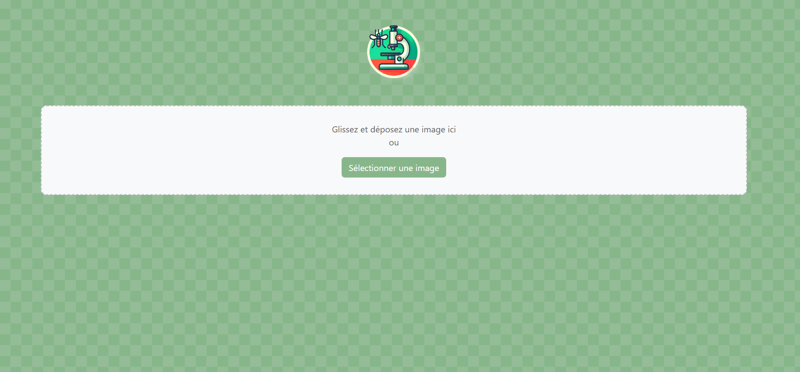
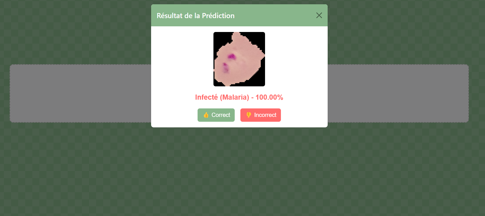

# **Malaria Project**

Ce projet est conçu pour une application liée à la prédiction de maladies grâce à l'intelligence artificielle. Voici une description complète des fichiers et sous-dossiers.

---

## **Aperçu de l'Application**

L'application web offre une interface simple pour l'analyse des images et la gestion des prédictions.

### **Page Principale**
La page principale permet de charger une image pour effectuer une prédiction. Voici un aperçu de l'interface :



---

### **Résultat de l'Analyse**
Après l'analyse d'une image, l'application retourne un résultat avec la prédiction et une estimation de confiance. Voici un exemple de l'affichage des résultats :



---

## **Structure du Projet**

```plaintext
palu/
├── compose.yaml
├── config.py
├── Dockerfile
├── README.Docker.md
├── requirements.txt
├── run.py
├── app/
│   ├── __init__.py
│   ├── ia-model/
│   │   ├── best_model.keras
│   │   ├── malaria_model.keras
│   │   └── metadata.txt
│   ├── routes/
│   │   ├── __init__.py
│   │   └── api_routes.py
│   ├── static/
│   │   └── styles.css
│   └── templates/
│       └── index.html
```

---

## **Fichiers racine**

### 1. **`compose.yaml`**
Ce fichier définit la configuration de Docker Compose pour orchestrer le conteneur. Il contient :
- Les services (comme le serveur Flask).
- Les volumes montés pour sauvegarder les données.
- Les ports exposés pour accéder à l'application.

### 2. **`config.py`**
Fichier de configuration principal. Il contient :
- Les chemins de base (`BASE_DATA_PATH`).
- Les classes de labels.
- Les configurations spécifiques à l'application.

### 3. **`Dockerfile`**
Utilisé pour construire l'image Docker de l'application. Points clés :
- Basé sur `python:3.11-slim`.
- Installe les dépendances système et Python.
- Définit le point d'entrée à `run.py`.

### 4. **`README.Docker.md`**
Document complémentaire décrivant comment utiliser Docker pour construire et exécuter le projet. Probablement des instructions détaillées pour `docker build` et `docker-compose`.

### 5. **`requirements.txt`**
Liste des dépendances Python nécessaires pour l'application, telles que Flask, TensorFlow, et d'autres bibliothèques utilisées par le projet.

### 6. **`run.py`**
Fichier d'entrée principal pour exécuter l'application Flask. Il initialise le serveur et configure les routes.

---

## **Dossier `app/`**

### 1. **`__init__.py`**
Initialise le package Flask et configure l'application. Il inclut probablement les Blueprints et d'autres extensions.

### 2. **`ia-model/`**
Ce sous-dossier contient les modèles d'intelligence artificielle et des métadonnées associées :
- **`best_model.keras`** : Modèle optimisé pour les prédictions.
- **`malaria_model.keras`** : Modèle secondaire ou initial.
- **`metadata.txt`** : Informations sur les modèles (exemple : précision, dataset utilisé).

### 3. **`routes/`**
Contient les fichiers liés aux routes de l'application Flask :
- **`__init__.py`** : Initialise les routes.
- **`api_routes.py`** : Définit les endpoints principaux, comme ceux pour gérer les feedbacks ou les prédictions.

### 4. **`static/`**
Dossier pour les fichiers statiques tels que les feuilles de style CSS, les images ou les fichiers JavaScript :
- **`styles.css`** : Fichier CSS utilisé pour styliser l'application web.

### 5. **`templates/`**
Dossier pour les fichiers HTML rendus par Flask :
- **`index.html`** : Page principale de l'application web.

---

## **Installation et Utilisation**

### 1. **Prérequis**
- Python 3.11 ou Docker (si exécuté dans un conteneur).
- Les bibliothèques mentionnées dans `requirements.txt`.

### 2. **Exécution sans Docker**
1. Créer un environnement virtuel :
   ```bash
   python -m venv venv
   source venv/bin/activate  # ou venv\Scripts\activate sous Windows
   ```
2. Installer les dépendances :
   ```bash
   pip install -r requirements.txt
   ```
3. Lancer l'application :
   ```bash
   python run.py
   ```

### 3. **Exécution avec Docker**
1. Construire et exécuter avec Docker Compose :
   ```bash
   docker-compose up --build
   ```
2. Accéder à l'application via [http://localhost:5000](http://localhost:5000).

---

## **Endpoints Principaux**

### **1. `/api/v1/feedback` (POST)**

- **Description :** Enregistre les feedbacks utilisateurs avec les images associées.
- **Requiert :** Un JSON contenant :
  - `label` : Label de la prédiction.
  - `correct` : Booléen indiquant si la prédiction est correcte.
  - `image` : Donnée de l'image encodée en Base64.

#### **Exemple de requête :**
```json
POST /api/v1/feedback
Content-Type: application/json

{
  "label": "infected",
  "correct": true,
  "image": "data:image/png;base64,iVBORw0KGgoAAAANSUhEUgAAAAUA..."
}
```

#### **Exemple de réponse :**
```json
200 OK
{
  "message": "Feedback enregistré avec succès."
}
```

En cas d'erreur dans les paramètres :
```json
400 Bad Request
{
  "error": "Paramètres invalides"
}
```

---

### **2. `/api/v1/predict-malaria` (POST)**

- **Description :** Analyse une image et retourne une prédiction concernant la présence de malaria.
- **Requiert :** Un JSON contenant :
  - `image` : Donnée de l'image encodée en Base64.

#### **Exemple de requête :**
```json
POST /api/v1/predict-malaria
Content-Type: application/json

{
  "image": "data:image/png;base64,iVBORw0KGgoAAAANSUhEUgAAAAUA..."
}
```

#### **Exemple de réponse :**
```json
200 OK
{
  "prediction": "infected",
  "confidence": 0.95
}
```

En cas d'erreur lors de l'analyse :
```json
500 Internal Server Error
{
  "error": "Erreur lors de l'analyse de l'image"
}
```

---

### **3. `/api/v1/health` (GET)**

- **Description :** Vérifie l'état de santé de l'API pour s'assurer qu'elle est fonctionnelle.
- **Requiert :** Aucun paramètre.

#### **Exemple de requête :**
```plaintext
GET /api/v1/health
```

#### **Exemple de réponse :**
```json
200 OK
{
  "status": "healthy",
  "uptime": "72:15:36"  # Temps écoulé depuis le démarrage
}
```

En cas de problème (rare) :
```json
500 Internal Server Error
{
  "error": "Service non disponible"
}
```

---

## **Résumé des Endpoints**
| Méthode | Endpoint              | Description                                      |
|---------|-----------------------|--------------------------------------------------|
| `POST`  | `/api/v1/feedback`    | Enregistre les feedbacks utilisateurs.          |
| `POST`  | `/api/v1/predict-malaria` | Retourne une prédiction basée sur une image fournie. |
| `GET`   | `/api/v1/health`      | Vérifie l'état de santé de l'API.               |

## **Auteur**
HEM Patrick
